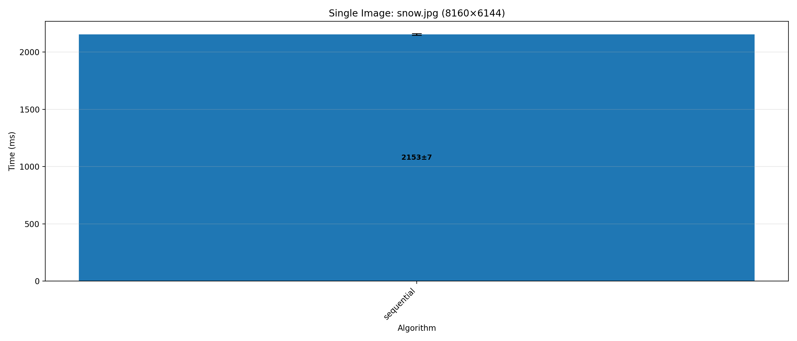

# Convolution Filters

Приложение для применения фильтров свёртки ([convolution](https://lodev.org/cgtutor/filtering.html)) к изображениям с различными стратегиями параллельной обработки 

## Quick Start

Сборка проекта:
```bash
./gradlew build
```

### Commands

#### sequential
Последовательная обработка изображения
```bash
./gradlew run --args "sequential <filename> <filter>"
```
- `filename` - путь к изображению (требуется)
- `filter` - тип фильтра (требуется)
## Benchmarks

### Single Image: snow.jpg (8160×6144)



| Algorithm | Time (ms) | Error (ms) |
|-----------|-----------|-----------|
| sequential | 2546 | 56 |
